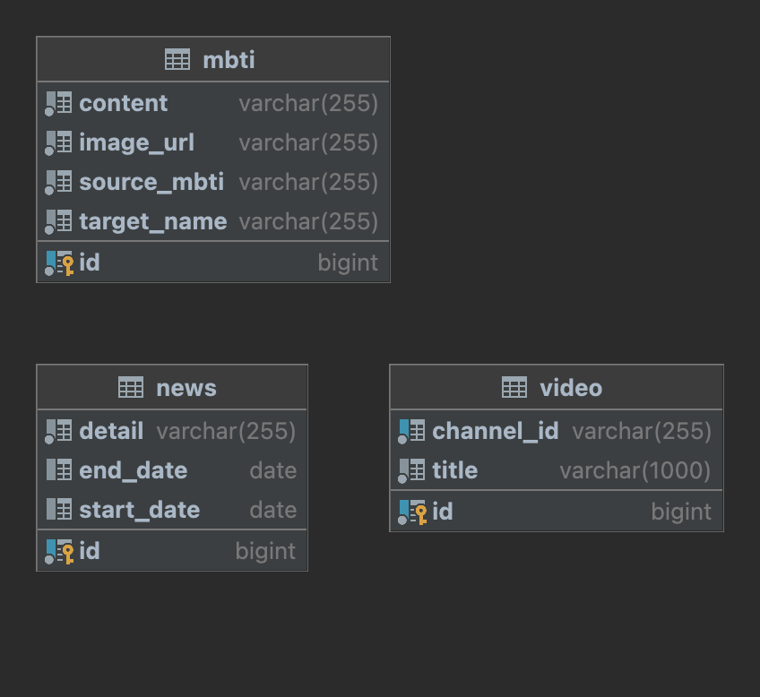

# For NewJeans Api Server

본 프로젝트는 [FRJNS-Client](https://github.com/GDSC-SKHU/FRJNS-Client)에 정보를 전달하는 API 서버입니다.

## Introduce

* 크롤링 된 뉴진스 관련 유튜브 url을 제공 (크롤링은 [FRJNS-Crawler](https://github.com/GDSC-SKHU/FRJNS-Crawler)을 이용하여 정보를 최신화 했습니다.)
* 현재 달 기준 뉴진스의 스케줄을 제공합니다. (마지막 최신화 - 23년 1월)
* 자신의 MBTI로 어떤 뉴진스 멤버와 잘 맞는지 제공해줍니다.

## DB ERD

## Tech Stack

* JDK-17
* Spring Boot-3.0.2
* MySQL(AWS-RDS)

## Deployment Environment

* Oracle Cloud Instance
* Docker
* Nginx

## Try it

* [Client](https://frjns.pages.dev/)
* [Server](https://frjns.ddns.net/)

## API Docs

* [Docs](https://documenter.getpostman.com/view/18874212/2s8ZDeUeeM)

## License

* [MIT License](LICENSE)